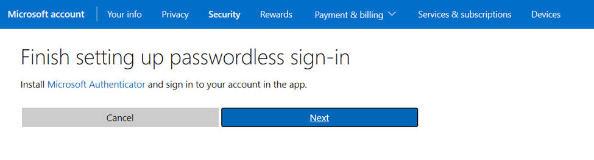

# IPWorks FileMailer 

A simply C# console application that uses FileMailer from ipWorks to send an email using a gmail, hotmail or yahoo account enabled with Multi Factor Authentication (MFA). 

## Replace Placeholders

In the appsettings.json replace the following 

    "From": "replace_with_sender@gmail.com",
    "SendTo": "replace_with_recipient@gmail.com",
    "User": "replace_with_gmail_account@gmail.com",
    "Password": "replace_with_app_password_for_MFA",
    "RuntimeLicense": "replace_with_ipWorks_License",

For gmail, use     

    "MailServer": "smtp.gmail.com",

For hotmail, use 

    "MailServer": "smtp.office365.com",
 
## How to get password for MFA 

When MFA is enabled, the password you use to log into the gmail account is not the one you need to use in ipWorks configuration. This needs to be the app password you generated by following these steps. 

### Gmail

- Go to your Google Account settings (https://myaccount.google.com/).
- Navigate to the "Security" section.
- Under "Signing in to Google", click on "App passwords".
- Select "Mail" from the dropdown list and "Other (Custom name)" if available, then click "Generate".
- Copy the generated password and use it in the appsettings.config above.git 

### Yahoo 

- Go to your Yahoo Account security settings (https://login.yahoo.com/account/security).
- Click on "Generate app password" under "App passwords".
- Select "Other app" and give it a name, then click "Generate".
- Use the generated password in the appsettings.config above.git 

### Hotmail

- Go to your Microsoft account security settings (https://account.microsoft.com/security/).
- Click on Advanced Security Options 

- Under Additional Security click on Two-Step vertification 
- Go through the guided steps and turn it on 
- Download the Microsoft Authenticator app on your mobile device and add your hotmail account to the Authenticator app 

- Now your two-step verification is ON and you can see the Create app password link 

- Click on the create app password link and your new app password will be displayed

- Copy the app password and use the generated password in the appsettings.config above.git 
